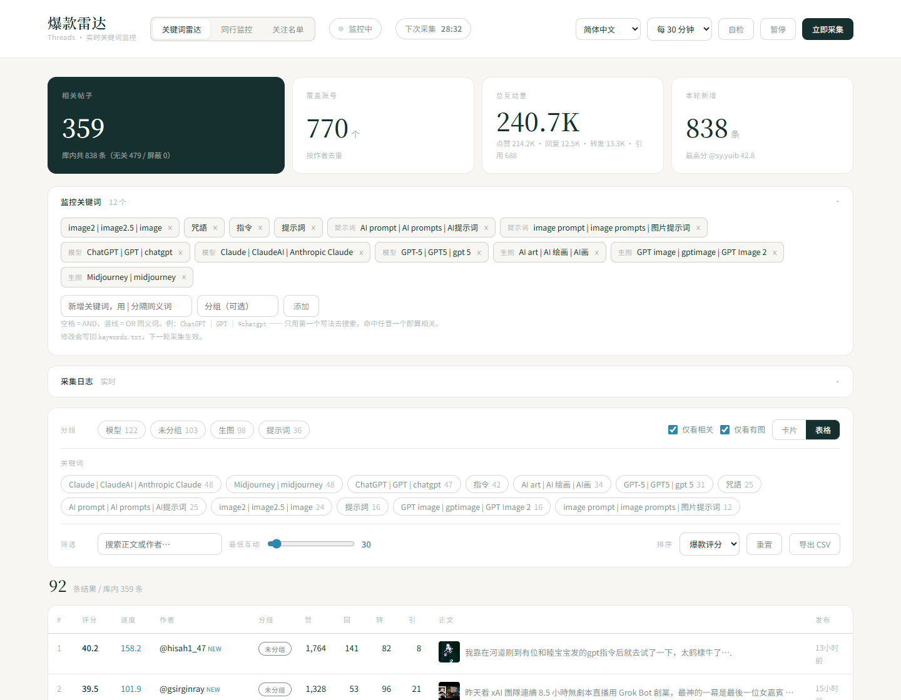

**简体中文** | [**English**](README.en.md) | [**繁體中文**](README.zh-TW.md) | [**日本語**](README.ja.md) | [**한국어**](README.ko.md)

<div align="center">

# Threads 爆款雷达

**实时盯着 Threads 上的 AI 关键词，把正在涨的帖子捞出来。**

免登录 · 免 OAuth · 不调官方 API · 零第三方依赖 · 挂在自己电脑上就能跑

[](https://www.python.org/)
[](requirements.txt)
[](LICENSE)
[]()

</div>

---

## 界面预览

**关键词雷达** — 主视图。默认只显示「有图 + 任一互动超过 30」的帖子。


**表格视图** — 一眼扫完评分、速度、四项互动指标。



**帖子详情** — 点任意一条打开。含四项指标、爆款评分、上涨速度、配图、判定依据。


**账号抽屉** — 点作者名进入，看他最近有哪些相关帖、是不是在稳定产出。


**通道告警** — 抓不到数据时，界面直接告诉你是哪一环断了（代理 / UA / 限流），不用猜。


**同行监控** — 按账号聚合，看谁在稳定产出爆款。


**关注名单** — 盯固定几个账号，看自上次查看以来有没有新帖。


**手机 / 平板** — 桌面、平板、手机三档断点自适应。


---

## 它解决什么问题

Threads 上 AI 相关的内容涨得很快，但**你几乎不可能及时看到**：

- 官方 API 的 `keyword_search` **一个互动指标都不给**（拿不到点赞、回复、转发数）
- 手动刷「为你推荐」是算法投喂，不是按关键词盯的
- 等一条帖子火了再刷到，早就过了选题窗口

这个工具做的事很简单：**按你给的关键词，每隔一段时间自动抓一遍，只留下有图、有热度的，按「正在涨」排序**。

它不是爬虫框架，是一个能长期挂机的单进程服务。

---

## 快速开始

### 1. 确认能访问 threads.com

浏览器打开 <https://www.threads.com>，能正常访问就行。

**如果打不开**（很多地区直连不通），需要先配一个代理。本项目用 Python 标准库 `urllib` 抓取，它会自动读取系统的 `http_proxy` / `https_proxy` 环境变量：

```bat
set http_proxy=http://127.0.0.1:7890
set https_proxy=http://127.0.0.1:7890
```

或者写进项目根目录的 `.env`（见 `.env.example` 里的说明）。

> ⚠ 代理端口填你本地代理客户端的「混合端口 / HTTP 端口」，不是 SOCKS 端口。

### 2. 启动

Windows 双击 `start.bat`，或者命令行：

```bash
python server.py
```

**不需要 `pip install`** —— 全程只用 Python 标准库。

### 3. 打开界面

浏览器访问 <http://127.0.0.1:8650>

首次启动会自动跑一轮采集（约 3~5 分钟），之后按设定间隔循环。

---

## 默认筛选规则

抓到的帖子很多，但**真正值得看的很少**。所以界面默认开了三道闸：

| 规则 | 默认值 | 说明 |
|---|---|---|
| 仅看相关 | ✅ 开 | 正文命中你的关键词（见下方「相关性过滤」） |
| 仅看有图 | ✅ 开 | **纯文字帖不显示** —— 没有视觉参考价值 |
| 最低互动 | **30** | 点赞 / 回复 / 转发**三项中任意一项**超过阈值 |

「最低互动」的口径是**三项取最大值**，而不是相加 —— 相加会把「34 赞 + 33 回 + 33 转」和「100 赞 + 0 + 0」判成同一档，但只有后者是真爆款。引用数不参与判定（它衡量的是「被引用讨论」，不是本条自身热度）。

**三个开关都在界面上，随时可以关掉看全量。** 阈值也可以写进 `.env` 固定下来：

```ini
RADAR_MIN_INTERACTIONS=30
```

---

## 它是怎么抓到数据的

### 核心：Googlebot UA + 服务端渲染

Threads 对普通浏览器 UA **不做内容服务端渲染** —— 只返回约 275 KB 的空壳页面，内容全靠 JS 加载。

但换成 **Googlebot UA** 之后，Meta 会老实返回完整 SSR 页面（1~2 MB），帖子数据以内嵌 JSON 形式直接给出。

于是就有了这条链路：

```
Googlebot UA 请求搜索页
  → 拿到 SSR HTML
  → 从 <script type="application/json"> 里抽 JSON
  → 递归定位帖子对象
  → 归一化字段
```

**免登录、无需 OAuth、不需要 App Review。**

### ⚠️ 改代码时最容易踩的坑：字段位置

四个互动指标**不在同一层**：

| 字段 | 位置 |
|---|---|
| `like_count` | 帖子对象**顶层** |
| `direct_reply_count` | 在 `text_post_app_info` 内（注意**不叫** `reply_count`） |
| `repost_count` | 在 `text_post_app_info` 内 |
| `quote_count` | 在 `text_post_app_info` 内 |

所以判定「是不是一个帖子对象」的条件必须**同时**包含 `code` + `like_count` + `text_post_app_info`。只判前两个会停在外层，导致后三个字段全部读成 0。

另外 `has_image` **不能**写成 `bool(raw.get("image_versions2"))` —— Threads 给每一条帖子（含纯文字帖）都返回了这个 key，纯文字帖的值是空壳 `{"candidates": []}`，那个布尔值会恒为 True（实测踩过：库里近两万条全被标成有图）。

---

## 关键词怎么写

编辑项目根目录的 `keywords.txt`，也可以在界面上增删（界面会写回同一文件）。

```
# 每行一个关键词，[方括号] 是分组

[模型]
ChatGPT | GPT | chatgpt
Claude | ClaudeAI | Anthropic Claude

[生图]
Midjourney | midjourney
AI art | AI 绘画 | AI画
```

三条规则：

- **`|` 表示同义词** —— 搜索时只用**第一个**写法，但正文命中任意一个都算相关。这样能在不牺牲精确度的前提下把召回补回来（很多帖只说「GPT」而不写全称）。
- **空格表示 AND** —— `AI prompt` 要求「AI」和「prompt」都出现。连写形式也会命中（`#aiprompt`）。
- **`[分组]`** 只是给界面分类用，随时可以改。分组名**不会**被翻译成其他语言 —— 因为它同时是数据值，译了你就没法拿界面上的词去文件里搜了。

---

## 相关性过滤

Threads 的搜索返回的不是「正文含该词」的结果，而是**语义相关**结果。实测搜「AI prompt」会返回印尼语/马来语蹭流量帖，甚至出现政治人物谈 AI 监管的帖子（一万多赞冲到榜首）。这些帖子虽然与 AI 沾边，但对选题毫无价值。

所以需要一个过滤层，纯关键词规则，不调用任何模型：

| 判定 | 条件 |
|---|---|
| `blocked` | 命中 `blocklist.txt` 里的屏蔽词 → 直接排除 |
| `relevant` | 正文命中关键词（整条短语，或全部有效词，或连写形式） |
| `offtopic` | 其余（被搜索召回但与关键词无关） |

两个实现细节：

1. **`ai` 这类短词用子串匹配会误伤** `said` / `again` / `available`，所以纯 ASCII 词采用近似词边界匹配（前后不能接字母数字）。
2. **`tag` 字段也参与匹配** —— 一条帖子如果属于「AI Threads」社群，它的 tag 会提供「AI」这个词。所以正文只有「prompt」的帖子也能命中关键词 `AI prompt`。

**「必须命中关键词」是这个方案的固有代价**：像「ChatGPT Images 2.5 能給我們設計師留一條生路？」这种明显 AI 相关、但没写进关键词表的帖子会被判成 offtopic。**解决办法是把词加进 `keywords.txt`，而不是放宽规则** —— 放宽会立刻涌进大量噪音。

### 零互动的帖子不入库

Threads 搜索为了凑齐一页，会返回大量**刚发布、还没有任何反应**的帖子。实测某一轮抓到 1,421 条里，判为相关的只有 359 条，其余几乎全是零赞、与关键词无关的噪音。

所以采集层加了一道闸：**四项互动全为 0 的帖子不写进数据库**。

这不是「永久丢弃」，而是**延迟入库** —— 帖子下次被采到时如果已经有互动，就会正常收进来。代价只是失去「零互动那一段」的涨幅轨迹，而不是永远看不到这条帖子。

> 这条规则比「互动低于某个值就不收」温和得多：后者会把已经起步、正在上涨的帖子一并挡掉。

---

## 抓取变体与封禁风险

Threads 同一个搜索词，加上不同 `serp_type` 参数会返回**不同批次**的结果，相当于翻页。

实测各变体之间的帖子**重叠只有 50~63%**：

| 查询 | base | recent | profile | 三者并集 |
|---|---|---|---|---|
| `q=Claude` | 76 帖 | 74 帖 | 74 帖 | **137 帖（+80%）** |
| `q=ChatGPT` | 61 帖 | 60 帖 | 62 帖 | **109 帖（+79%）** |

所以多开变体是提升召回最直接的手段：

```ini
RADAR_SERP_TYPES=base,profile,recent
```

可用值：`base`（不带参数）、`recent`、`top`、`tag`、`profile`、`default`。

### ⚠️ 变体数直接决定封禁风险

**这是本项目最需要克制的参数。** 实测数据：

| 配置 | 请求数 | 结果 |
|---|---|---|
| 3 变体 × 19 词 | 57 请求/轮（约 114/小时） | **连续三轮后 threads.com 返回 502**，约 20 分钟自愈 |
| 2 变体 × 19 词 | 38 请求/轮 | 稳定 |
| 3 变体 × 12 词 | 36 请求/轮（约 72/小时） | 稳定（当前默认值） |

**建议**：`词数 × 变体数 ≤ 40`，并把间隔拉到 30 分钟以上。一旦被限，**降低压力并停一段时间是唯一有效的恢复方式**，硬重试只会延长封锁。

排查被限的方法：同时测 `threads.com` 和一个无关站点（如 `baidu.com`）。只有 threads 不通 → 出口被 Meta 风控；两个都不通 → 代理挂了。

---

## 实时监控怎么工作

服务内跑一个后台线程，按间隔循环采集。除了主流程，还有四层兜底：

- **通道自检** —— 一键探测当前代理通道是否还能拿到 SSR 页面，区分「抓取器坏了」还是「出口被封了」
- **熔断** —— 连续 3 轮「整轮零产出」自动暂停。整轮零产出说明是通道级故障，继续按间隔重试只会加深封禁
- **整轮看门狗** —— 笔记本休眠会让采集线程整个冻住（实测卡过 15.5 小时没返回），所以有一层「整轮」级别的超时兜底
- **中断残留收尾** —— 进程被杀后，数据库里状态还停在 `running` 的那一轮会被自动标记为中断

---

## 配置

所有配置都有内置默认值，写在项目根目录的 `.env` 即可（完整清单见 `.env.example`）。

```ini
RADAR_PORT=8650                        # 服务端口
RADAR_INTERVAL_MINUTES=30              # 采集间隔（分钟）
RADAR_SERP_TYPES=base,profile,recent   # 抓取变体，越多越全但越容易被风控
RADAR_MIN_INTERACTIONS=30              # 界面「最低互动」滑块的初始值
RADAR_CYCLE_MAX_SECONDS=1800           # 单轮时间上限（看门狗）
RADAR_FAILURE_LIMIT=3                  # 连续几轮零产出后熔断
RADAR_HOST=127.0.0.1                   # 绑定地址，默认只允许本机访问
```

界面里改采集间隔会**自动写回 `.env`**，重启后设置不会丢。

### HTTP 接口

服务同时提供 JSON 接口，方便你自己接别的工具：

| 方法 | 路径 | 说明 |
|---|---|---|
| GET | `/api/status` | 运行状态、统计、最近日志 |
| GET | `/api/posts?limit=&only_relevant=` | 帖子列表 |
| GET | `/api/authors?limit=&tier=` | 账号聚合榜 |
| GET | `/api/post/<code>` | 单条帖子详情 |
| GET | `/api/stream` | SSE 实时事件流 |
| GET | `/api/export?what=posts\|authors` | 导出 CSV（UTF-8 BOM，Excel 直接打开不乱码） |
| POST | `/api/collect` | 立即采集一轮 |
| POST | `/api/pause` `/api/resume` | 暂停 / 继续 |
| POST/DELETE | `/api/keywords` `/api/watchlist` | 关键词与关注名单的增删 |

---

## 常见问题

**Q：启动后一直转圈 / 抓到 0 条？**
点界面上的「自检」按钮。它会明确告诉你卡在哪一环：DNS、代理隧道、UA 被降级、还是被限流。

**Q：界面上的列表条数比「库内 N 条」少很多？**
这是设计如此。库内是原始抓取量，列表默认只显示「相关 + 有图 + 互动达标」的那部分。关掉筛选开关就能看到全量。

**Q：为什么「上涨速度」这一列全是 0？**
速度靠**比对前后两次采集的互动增量**算出来。刚清库或刚启动时每条帖子只有一条快照，需要积累 2 轮以上才能算出速度。

**Q：中文乱码？**
CSV 导出已经写了 UTF-8 BOM，Excel 直接打开不会乱码。如果是别的地方乱码，检查终端编码（Windows 下 `chcp 65001`）。

**Q：能部署到服务器上长期跑吗？**
可以，但注意两点：① `RADAR_HOST` 默认是 `127.0.0.1`（只允许本机访问），要对外提供服务需显式改成 `0.0.0.0`，**并且自己加一层反代和鉴权** —— 本项目没有用户系统；② 出口 IP 决定被风控概率，机房 IP 通常比家宽更容易被限。

---

## 已知限制

这些不是 bug，是方案本身的边界，写出来免得你踩：

1. **搜索召回有上限，覆盖面做不到 100%。** 每个查询只返回一页（约 50~80 条），社群（如「AI Art」）里刚发布、零互动的新帖排不进候选集。实测过：拿帖子的原文片段整句搜索返回 **0 条** —— 说明 Threads 搜索**不是全文索引**，而是算法候选集。
2. **社群页抓不到。** 浏览器里看到的「话题社群页」（带热门/近期 tab）是 JS 渲染的，无头抓取 SSR 拿到的是退化结果（实测返回的全是无关帖）。要覆盖它需要引入 JS 渲染 + 登录态，与本项目「零依赖、免登录」的定位直接冲突。
3. **刚发布的帖子噪音率极高。** 实测某一轮新入库帖里相关率只有 **1.5%**（而老帖是 34%~59%）。「实时」和「相关」本身是矛盾的 —— 已用「零互动不入库」压掉大部分。
4. **互动数大量为 0 是正常的。** 长尾帖居多，界面「最低互动」滑块就是为此准备的。
5. **依赖 Threads 的页面结构。** Meta 一旦改动 SSR 数据的组织方式，解析逻辑需要跟着改。`collector.py` 顶部的注释写清了字段位置，改起来不难。
6. **单机、单进程、无鉴权。** 定位是「挂在自己电脑上的个人工具」，不是多用户服务。

---

## 文件说明

```
threads-ai-radar/
├── server.py          HTTP 服务 + JSON 接口 + 静态文件
├── monitor.py         后台调度：定时采集、通道自检、熔断、看门狗
├── pipeline.py        一轮采集的编排：抓取 → 相关性判定 → 评分 → 入库
├── collector.py       采集层：Googlebot UA 抓 SSR 页，解析内嵌 JSON
├── relevance.py       相关性判定：纯关键词规则（blocked / relevant / offtopic）
├── scorer.py          爆款评分与上涨速度
├── store.py           SQLite 存储：建表、迁移、查询、账号聚合
├── config.py          配置读取（.env 加载与环境变量）
├── selftest.py        自检：跑一遍过滤与榜单，打印被剔除的样例
├── refilter.py        改了关键词后，重新过滤库里已有数据（不用重抓）
├── start.bat          Windows 一键启动
├── requirements.txt   空的 —— 本项目零第三方依赖
├── keywords.txt       监控关键词（界面可改，会写回本文件）
├── blocklist.txt      屏蔽词（命中直接排除）
├── watchlist.txt      关注名单
├── .env.example       配置示例
├── data/
│   └── radar.db       SQLite 数据库（自带一份示例数据，开箱即可看到界面效果）
├── docs/              README 用的截图
└── web/
    ├── index.html     单文件前端（无框架、无构建）
    └── i18n.js        五语文案字典与运行时（简中 / 英 / 繁中 / 日 / 韩）
```

**界面支持五种语言**：简体中文、English、繁體中文、日本語、한국어。右上角切换，选择记在 localStorage。界面文案全部翻译，但**帖子正文、账号名、分组名不翻译** —— 那些是数据，不是界面。

---

## 相关项目

| 项目 | 说明 |
|---|---|
| [**shuixian-manju-skills**](https://github.com/BaYue-SYJ/shuixian-manju-skills) | 水仙的漫剧 6 件套：从小说到短剧成片的创作技能集（灵感来源于 shuohao-skills） |
| [**shuixian-prompts**](https://github.com/BaYue-SYJ/shuixian-prompts) | 水仙的 AI 提示词画廊源码（公益提示词网站） |
| [**zimeiti-workbuddy**](https://github.com/BaYue-SYJ/zimeiti-workbuddy) | Creator Buddy：公众号 / 小红书 / 短视频的全流程创作 Skill 工具箱 |
| [**web-html-image-skill**](https://github.com/BaYue-SYJ/web-html-image-skill) | web-image：用 HTML/CSS 渲染出图，不依赖生图模型，32 套预设风格 |

---

## 关于作者

如果这个东西帮你省了时间，可以请我喝杯咖啡 ☕；想直接聊也欢迎加微信。

| 赞赏码 | 微信 | 公众号 |
|:---:|:---:|:---:|
|  |  |  |

公众号会写一些 AI 工具与提示词相关的东西。

---

## 社区

| [**Linux.Do**](https://linux.do) | Linux.Do — 与社区分享、讨论和跟踪发展 |

## 许可

[MIT](LICENSE) —— 随便用，改，分发。

> ⚠️ 请合理使用。内置的抓取间隔（30 分钟）和变体数（3 个）是实测下来不会被风控的配置，**调快之前请先读「抓取变体与封禁风险」那一节**。频繁抓取不仅会让自己被封，也会影响其他用户正常使用。
