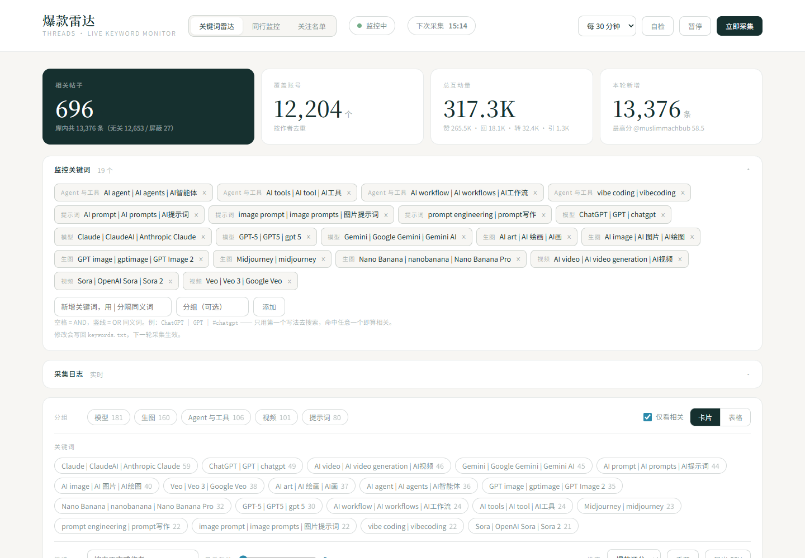
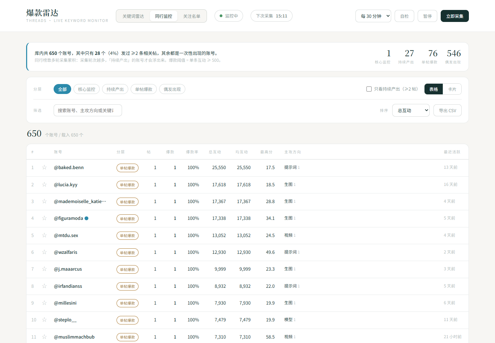
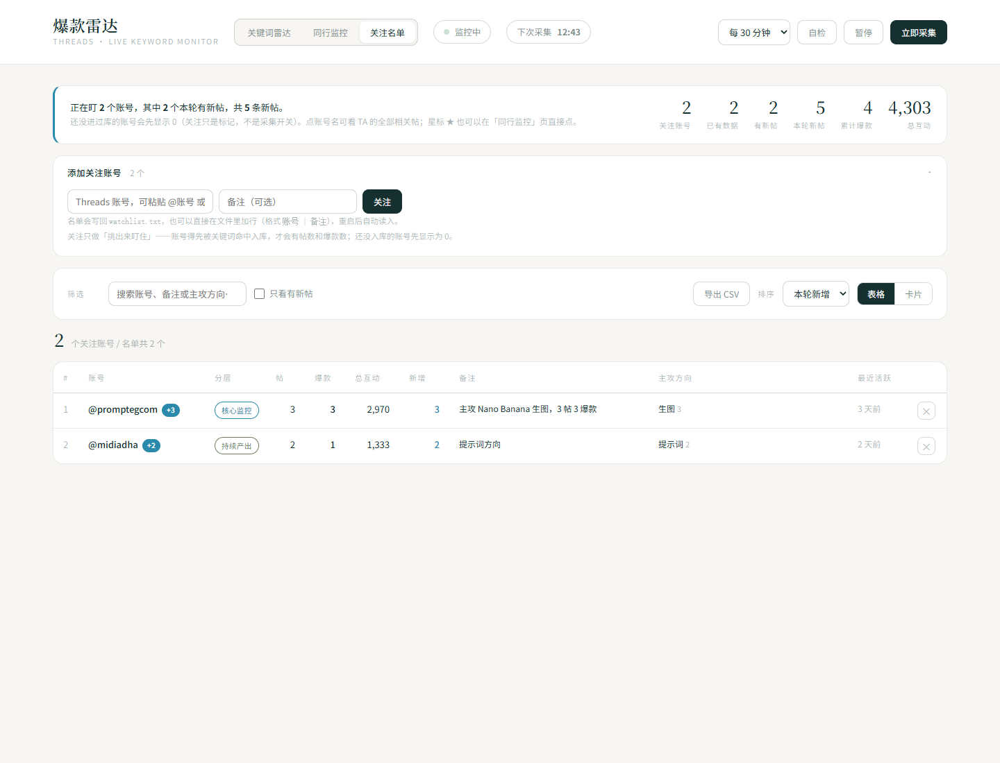
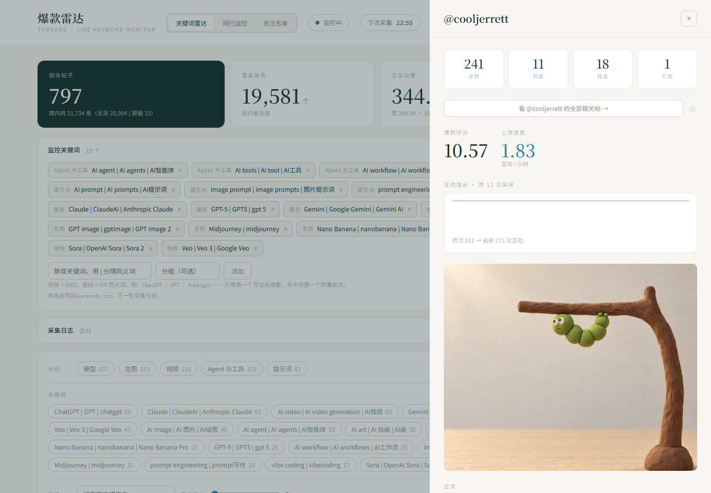
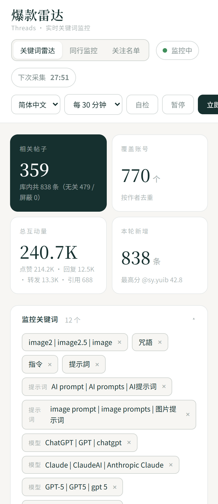
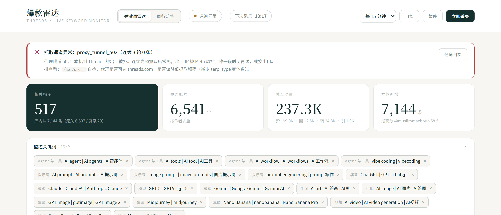
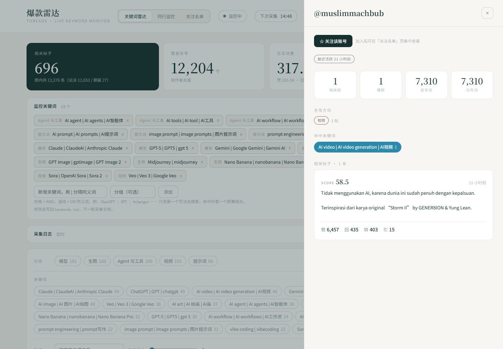

[**简体中文**](README.md) | [**English**](README.en.md) | **繁體中文** | [**日本語**](README.ja.md) | [**한국어**](README.ko.md)

# Threads 爆款雷達 · 即時關鍵字監控

監控 Threads 上與你關注的關鍵字相關的公開貼文，即時彙整成一張排行榜。

**零第三方依賴，只用 Python 標準庫**——裝好 Python 就能直接跑，不用 `pip install`。


三個檢視回答三個不同的問題：

| 檢視 | 回答的問題 |
|---|---|
| **關鍵字雷達** | 哪一則**貼文**正在爆 |
| **同行監控** | 誰在**持續產出**爆款（依帳號聚合 + 持續度分層） |
| **關注名單** | **我盯的人**裡，誰剛發了新東西 |

每個檢視都能把目前篩選結果匯出成 CSV（Excel 直開不亂碼）。

### 特性一覽

- **真·即時**：常駐程序按間隔自動採集，頁面走 SSE 推送，採集完立即刷新，不用手動點
- **四個互動指標齊全**：按讚 / 回覆 / 轉發 / 引用，一個都不少（官方 API 拿不到這些）
- **帶縮圖**：清單 / 卡片 / 詳情三處都能看圖，並標出這則是純文字 / 單圖 / 多圖 / 影片 —— 判斷爆款不用逐則點開
- **上漲速度單獨一欄**：`互動量 / 小時`，看的是「正在漲」而不是「歷史總量高」
- **互動成長曲線**：每次採集寫一筆快照，詳情裡能看到一則貼文的成長軌跡
- **通道健康檢查 + 熔斷**：失敗原因分類到具體理由，連續零產出自動停，不硬敲被封的出口
- **零依賴**：只用 `urllib` / `sqlite3` / `http.server` / `threading`，長期掛機不易因環境問題中斷
- **三檔響應式**：桌面 / 平板 / 行動，實測 54 種寬度×檢視組合無橫向溢出

---

## 介面預覽

> 截圖為實際執行狀態。不同圖的資料量因採集輪次不同而有差異。

| | |
|---|---|
| **關鍵字雷達**<br>哪則貼文正在爆 · 統計卡 + 關鍵字管理 + 分組產出 | **同行監控**<br>誰在持續產出爆款 · 持續度分層 + 表格/卡片雙檢視 |
|  |  |
| **關注名單**<br>我盯的人裡誰剛發了新東西 · 有新增的排最前 | **貼文詳情抽屜**<br>主圖 · 爆款評分 · 上漲速度 · 互動成長曲線 · 命中關鍵字 |
|  |  |

---

## 目錄

- [快速開始](#快速開始) · [先確認能連上 threads.com](#先確認能連上-threadscom) · [部署 / 給別人用](#部署--給別人用)
- [它是怎麼抓到資料的](#它是怎麼抓到資料的)（含欄位位置陷阱）
- [關鍵字怎麼寫](#關鍵字怎麼寫) · [相關性過濾](#相關性過濾) · [抓取變體](#抓取變體相當於翻頁)
- [即時監控怎麼運作](#即時監控怎麼運作)（響應式 / 健康檢查 / 熔斷 / 看門狗）
- [同行 / 競品監控](#同行--競品監控) · [關注名單](#關注名單) · [CSV 匯出](#csv-匯出)
- [檔案說明](#檔案說明) · [HTTP 介面](#http-介面) · [評分](#評分) · [設定](#設定)
- [常見問題](#常見問題) · [已知限制](#已知限制) · [關於作者](#關於作者) · [授權](#授權)

---

## 快速開始

需要 **Python 3.10 以上**，不需要 `pip install`（零第三方依賴）。

```
雙擊 start.bat
```

或者：

```bash
python server.py
```

然後瀏覽器打開 **http://127.0.0.1:8650**

啟動時會立刻跑第一輪採集，之後按設定間隔自動循環。

### 先確認能連上 threads.com

這是**唯一一個容易卡住的地方**。程式用 Python 標準庫 `urllib` 抓取，
`urllib` 會自動讀取系統的 `http_proxy` / `https_proxy` 環境變數，
所以直連不通時按下面任一種方式配上代理即可。

**方式一：填進 `.env`**（推薦，跟著專案走）

```bash
cp .env.example .env          # Windows: copy .env.example .env
```

然後編輯 `.env`，取消註解並改成你自己的埠：

```env
http_proxy=http://127.0.0.1:7890
https_proxy=http://127.0.0.1:7890
```

**方式二：設成系統環境變數**（Windows 命令列臨時生效）

```bat
set http_proxy=http://127.0.0.1:7890
set https_proxy=http://127.0.0.1:7890
```

> 埠去哪找：Clash / v2rayN 等客戶端裡的「HTTP 埠」或「混合埠」。
> **不要寫 `socks5://`** —— `urllib` 不支援 socks 代理，必須用 HTTP 埠。

配完可以點介面右上角的 **通道自檢**（`POST /api/probe`）驗證，
或直接用命令列確認：

```bash
python -c "from collector import probe_channel; print(probe_channel())"
```

> ⚠️ 代理必須開著才能採集。關掉代理後通道會報 502（`proxy_tunnel_502`）。
> 排查時先拿 `baidu.com` / `api.github.com` 對比：這兩個通、只有 `threads.com`
> 不通 → 出口被 Meta 風控（降低頻率，約 20 分鐘自癒）；三個都不通 → 代理本身掛了。
> 通道狀態和失敗原因都會顯示在介面頂部的告警條裡。

---

## 部署 / 給別人用

**本專案定位是「單機自用的即時監控台」，不是公網服務**，預設只監聽 `127.0.0.1`。
給別人用最簡單的辦法就是讓對方 clone 下來自己跑。

```
git clone https://github.com/BaYue-SYJ/threads-ai-radar.git
cd threads-ai-radar
# 配好代理（見上節）
start.bat            # 或 python server.py
```

三條須知：

1. **不需要裝任何依賴**，裝好 Python 就能跑。資料庫 `data/radar.db` 首次啟動自動建立。
2. **每台機器各自採各自的資料**。本程式不帶帳號體系，也不做資料同步。
   想兩個人看同一份排行榜，就都連到同一台機器（見下條）。
3. **不要在公網上裸奔**。HTTP 服務沒有任何鑑權，任何能連到埠的人
   都能改你的關鍵字和關注名單。真要區域網路共享，請只綁內網位址：

   ```env
   RADAR_HOST=0.0.0.0        # 或在 .env 裡綁具體內網 IP，如 192.168.1.10
   ```

   然後靠防火牆限制來源 IP。**不要**做埠轉發到公網。

### 關於 `tools/` 目錄（可選）

`tools/` 裡是我改這個專案時用的**回歸測試腳本**，跑它們需要額外裝 Node：

| 腳本 | 作用 | 依賴 |
|---|---|---|
| `check_e2e.cjs` | 端到端回歸：關注名單增刪、星號、雙向跳轉、CSV 匯出全點一遍（39 條斷言） | puppeteer-core |
| `check_watch.cjs` | 響應式掃描：18 個寬度 × 3 個檢視 = 54 種組合，查橫向溢出與 JS 報錯 | puppeteer-core |
| `shots3.cjs` | 三檢視自動截圖（桌面 1440 / 平板 1024 / 手機 390） | puppeteer-core |
| `scan_broken_modules.cjs` | 掃 `node_modules` 裡「套件還在但入口檔案沒了」的殘缺套件 | **無** |

**只用工具的話完全不用管這個目錄。** 想跑回歸：

```bash
npm i -D puppeteer-core
node tools/check_watch.cjs        # 服務需先啟動
```

腳本會自動探測 Chrome；探不到就用 `CHROME_PATH` / `PUPPETEER_PATH` 指定。

---

## 它是怎麼抓到資料的

這是整個專案最關鍵的一點，先說清楚。

**官方 Threads API 這條路走不通：** `keyword_search` 需要過 Meta App Review；未過審前只回傳你自己發的貼文；而且回應裡**根本不含**按讚 / 回覆 / 轉發 / 引用這四個數字。一個拿不到互動資料的「爆款雷達」等於不存在。

**實際採用的是：Googlebot UA + 伺服器端渲染。**

| 請求方式 | 回傳內容 |
|---|---|
| 一般瀏覽器 UA | ~275KB 的 SPA 空殼，**沒有任何貼文資料** |
| `Googlebot` UA | **1.0~1.9MB 完整 SSR 頁面**，貼文資料以內嵌 JSON 直接給出 |

免登入、無需 OAuth、無需 App Review、零成本，四個互動指標全部可取。

### 欄位位置（改程式時最容易踩的坑）

四個指標**不在同一層**：

| 欄位 | 位置 |
|---|---|
| `like_count` | 貼文物件**最上層** |
| `direct_reply_count` | `text_post_app_info` 內，**注意不叫 `reply_count`** |
| `repost_count` | `text_post_app_info` 內 |
| `quote_count` | `text_post_app_info` 內 |

判定一個物件是不是貼文，條件必須同時包含 `code` + `like_count` + `text_post_app_info`。
只寫前兩個會**停在外層不再下鑽**，後三個欄位會全部讀成 0——這個坑我在開發時真踩過一次。

---

## 關鍵字怎麼寫

編輯 `keywords.txt`，或者直接在介面頂部的「監控關鍵字」面板裡增刪。

```
[模型]                    ← 方括號是分組，會直接用作介面上的分類
ChatGPT | GPT | chatgpt   ← 豎線分隔同義詞
AI prompt                 ← 空格 = AND
```

- **空格 = AND**：`AI prompt` 要求正文同時出現 AI 和 prompt
- **豎線 = OR**：`ChatGPT | GPT` 命中任一個即算相關。
  **只用第一個寫法去搜尋**，後面的只用於判定。很多貼只說 `GPT` 不寫全稱，加同義詞才不會漏。
- 自動相容主題標籤連寫：`#aiprompt` 也能命中 `AI prompt`
- 對 `ai` 這類短詞用近似詞邊界匹配，不會誤傷 `said` / `available`

## 相關性過濾

Threads 的搜尋是**語意召回**，不是「正文含該詞」召回。實測搜 `AI prompt` 會回傳印尼語蹭流量貼、甚至政治人物談 AI 監管的貼文（11,168 讚衝上榜首）。

所以每輪採集後都會給貼文打一個判定：

| 判定 | 含義 |
|---|---|
| **相關** | 正文命中關鍵字短語，或全部有效詞，或同義詞 |
| **無關** | 被搜尋召回，但正文與關鍵字無關 |
| **封鎖** | 命中 `blocklist.txt` 的噪音詞 |

介面上的「**僅看相關**」開關控制是否顯示後兩類，預設開啟。

**相關率天生偏低，實測約 4%**——這是 Threads 搜尋的固有特性，不是 bug。
本機累計 16,710 條召回裡篩出 730 條相關（**4.4%**，2026-09-15 快照）。
極端例子：搜 `Nano Banana` 召回 64 條，其中含 "banana" 的是 **0 條**——
全是印尼語「nano KOL」行銷貼，過濾器正確地把它們全擋掉了。

> 相關率低不等於沒用：過濾掉的是語意噪音，留下的是真命中。
> 想提高覆蓋面，加關鍵字和變體比調過濾器更有效。

改完關鍵字或封鎖詞後想重新判定已有資料，不用重抓：

```bash
python refilter.py
```

---

## 抓取變體（相當於翻頁）

Threads 搜尋頁的 `serp_type` 參數會回傳**不同批次**的結果。多取幾個變體再合併去重，
效果相當於翻頁——這比走內部 GraphQL 拿游標更可靠（實測 GraphQL 通道需要真實瀏覽器
工作階段的 cookie + csrf，直接 POST 只會回傳 HTML 外殼；而且 doc_id 會輪換）。

**⚠️ 選變體要看「相關貼產出」，不能看「原始條數」——兩者差異極大。**

實測各變體新增的**相關貼**數（以 base 為基準）：

| 關鍵字 | base | recent | top | tag | **profile** | **default** |
|---|---|---|---|---|---|---|
| ChatGPT | 15 | +0 | +0 | +0 | **+17** | +9 |
| Nano Banana | 3 | +0 | +2 | +1 | **+13** | +7 |
| AI prompt | 21 | +6 | +0 | +1 | +0 | **+10** |

`recent` 原始條數新增很多，但**幾乎全是語意噪音**；真正的價值在 `profile` 和 `default`。
我最初按原始條數選了 `base,recent,top`，實際挑中的是兩個最弱的變體——按相關貼產出重選後才拿到真實收益。

三變體實測效果：

| | 單變體 | 三變體 | 提升 |
|---|---|---|---|
| 庫內總數 | 980 | **3,865** | 3.9× |
| **相關貼文** | 136 | **415** | **3.1×** |
| 覆蓋帳號 | 941 | 3,562 | 3.8× |
| 每輪耗時 | ~2 分鐘 | ~7 分鐘 | 3.5× |

### ⚠️ 變體數與封禁風險直接相關（實測踩過）

三變體 × 19 關鍵字 = **57 請求/輪**，跑滿三輪後 `threads.com` 開始對本機出口回傳：

```
urllib.error.URLError: Tunnel connection failed: 502 Bad Gateway
```

同時 `baidu.com`、`api.github.com` 仍是 200 —— 說明**不是代理掛了，也不是 Threads 下線**，而是出口 IP 被 Meta 風控。約 20 分鐘後自行恢復。

結論：**長期掛機用 2 個變體以內**（預設 `base,profile`），間隔拉到 30 分鐘以上。被限後唯一有效的恢復手段是降低壓力 + 停一段時間，硬重試只會延長封鎖。

> 排查此類問題必須先分通道驗證：拿 `baidu.com` / `api.github.com` 對比，才能把「代理整體故障」和「單一目標被風控」區分開。

---

## 即時監控怎麼運作

`server.py` 啟動時會在程序內拉起一個背景排程執行緒：

- 按固定間隔（預設 15 分鐘）循環採集全部關鍵字
- 關鍵字之間插入 1.8~4.2 秒**隨機抖動**，避免固定節奏觸發風控
- 頁面透過 **SSE**（`/api/stream`）接收推送，每 2 秒同步一次狀態，採集完成立即刷新排行榜
- 每次採集都會往 `snapshots` 表寫一筆互動數快照，詳情抽屜裡能看到增速曲線

介面上能看到：

- 導覽列即時狀態點：**監控中 / 採集中 / 已暫停 / 通道異常**
- 下次採集**倒數**
- 採集進度條 `7/19 · Midjourney`
- 捲動採集日誌（含異常告警）
- 新入庫貼文帶 **NEW** 角標

### 響應式

三個檢視都適配桌面 / 平板 / 行動三檔，實測 **18 個寬度（390~1680px）× 3 個檢視 = 54 種組合均無橫向溢出**：

<p align="center">
  
</p>

| 斷點 | 導覽列 | 同行表格 | 關注名單表格 |
|---|---|---|---|
| ≥1181px | 單行 | 全部 11 欄 | 全部欄 |
| 1081~1180px | 收緊間距 | 隱藏爆款率 / 均互動 / 最高分（爆款率可由貼數算出） | 隱藏主攻方向（把寬度讓給備註） |
| ≤1080px | 操作區換到第二行 | 同上 | 同上 |
| ≤860px | 同上 | 預設切到**卡片檢視**；若手動切表格，容器內可橫向滑動（不靜默裁欄） | 同上；表單改為整行堆疊 |

> 踩坑記錄：加第三個標籤（關注名單）之後，導覽列的最小內容寬度漲到 **1078px**。
> 原來只在 860px 斷點做換行，結果 **1024px 時右側控制項被擠出螢幕 54px**——
> 桌面和手機都正常，只有中間這一段壞，很容易漏掉。
> 現在的做法是單行塞不下就整體下移，而不是繼續壓間距：壓到後面按鈕會擠成一團。
>
> 順帶一個坑：**`getBoundingClientRect().right > clientWidth` 的溢出偵測會把關閉狀態的抽屜全算成溢出**
> ——它是靠 `translateX(101%)` 挪到螢幕外的。偵測腳本必須排除抽屜，否則每個寬度都誤報。
> 更可靠的判據是 `documentElement.scrollWidth > clientWidth`。

### 健康檢查與通道自檢

每次抓取都會校驗「回應體積 ≥ 400KB 且解析出 ≥ 5 則貼文」，不達標記為異常。

但光有體積檢查不夠——**「抓到了但頁面沒資料」和「鏈路根本不通」是兩回事**，前者重啟抓取器就行，
後者硬重試只會加深風控。所以失敗會被歸到具體原因：

| reason | 含義 | 該怎麼辦 |
|---|---|---|
| `proxy_tunnel_502` | 代理隧道 502，出口被拒 | 降低頻率 + 停一段時間 |
| `rate_limited` | HTTP 429 被限流 | 減少變體數、拉長間隔 |
| `connect_timeout` | 直連被阻斷 | 走可用代理 |
| `tls_reset` | TLS 被中間設備重置 | 換鏈路 |
| `gateway` | 上游 5xx | 一般可自癒 |
| `empty_shell` | 拿到頁面但無 SSR | UA 被降級，檢查是否改過 `RADAR_USER_AGENT` |

點導覽列的「**自檢**」或直接呼叫 `/api/probe`，會發**一個**請求快速判定通道狀態，不用等整輪跑完。



上圖為出口被風控時的真實介面：頂部紅條給出**具體原因**（`proxy_tunnel_502`）和
**可執行建議**（停一段時間再試、或降低變體數），而不是只在日誌裡留一行「頁面異常」。
導覽列狀態點也會同步變成「通道異常」。

### 熔斷

一旦出現**整輪零產出**（19 個關鍵字一則都沒抓到），說明是通道級故障而非個別關鍵字沒資料。
連續 **3 輪**如此會**自動暫停監控**並在日誌裡說明原因——避免按間隔持續敲打一個已被封的出口。

介面上會頂出一條紅色告警條，寫明原因和建議，而不是只在日誌裡留一行「頁面異常」。

### 整輪看門狗

單輪採集有**硬性時間上限**（`RADAR_CYCLE_MAX_SECONDS`，預設 1800 秒 = 30 分鐘）。
到點就中止本輪，日誌寫明在第幾個關鍵字處停下、為什麼。

為什麼需要：**筆電休眠會把採集執行緒整個凍住**。實測跑完第 7 個關鍵字後機器進入休眠，
執行緒停在原地 **15.5 小時**沒有返回（跨休眠時單一請求的 socket 逾時未必生效），
期間下一輪採集一直被阻塞。看門狗在每個關鍵字開始前檢查是否逾時，恢復後立刻收尾退出，
下一輪才能正常開始。

提前中止時 `keywords_done` 會按**實際跑完的數量**如實記錄（如 `9/19`），
不會謊報成「本輪全部完成」。

### 中斷殘留記錄自動收尾

程序被強殺（或看門狗中止）時，採集記錄會停在 `running`。啟動時會自動掃一遍，
把這類記錄標成 `error / 進程中斷，本輪未完成`——否則介面上會一直顯示「採集中」，
讓人覺得工具卡死了。

---

## 同行 / 競品監控

關鍵字榜回答的是「**哪則貼文火了**」；同行榜回答的是「**誰在持續產出爆款**」。
後者要依作者聚合，而且是這個專案真正的差異化點——競品監控看的是人和方法論，不是單則貼文。

介面頂部第二個標籤「**同行監控**」，依作者聚合相關貼：

- **分層**：依持續度自動標記，這才是篩選監控目標的依據

  | 分層 | 條件 | 含義 |
  |---|---|---|
  | 核心監控 | 貼 ≥ 3 且 爆款 ≥ 2 | 方法論穩定，值得長期盯 |
  | 持續產出 | 貼 ≥ 2 | 有穩定輸出 |
  | 單貼爆款 | 貼 = 1 且 爆款 ≥ 1 | 可能是運氣 |
  | 偶發出現 | 其餘 | 一次性出現 |

  （爆款 = 單則貼文互動量 ≥ 500，門檻見 `store.HIT_THRESHOLD`）

- **每列給出**：相關貼數、爆款數、爆款率、總互動、單則均互動、最高評分、主攻方向、最近活躍
- **點任一帳號**打開抽屜：分層、發文節奏（約 N 則/週）、主攻方向、命中關鍵字，以及該帳號全部相關貼
- **排序**：爆款數 / 相關貼數 / 總互動 / 單則均互動 / 爆款率 / 最高評分 / 最高按讚 / 本輪新增

### 為什麼一定要做「持續度」過濾

資料量小時，絕大多數帳號只出現過一次。實測首輪 391 個作者裡：

```
貼數 ≥ 1：391        貼數 ≥ 2：14        貼數 ≥ 3：5
分層分布：核心監控 1 / 持續產出 13 / 單貼爆款 50 / 偶發出現 327
```

**96% 的帳號是「一次性出現」**。如果直接按爆款數排序，榜單會被單則作者佔滿，完全看不出誰值得長期盯。
所以預設提供「只看持續產出（≥2 貼）」開關，且各分層有各自的預設排序欄位。

介面頂部會顯示樣本厚度，說明「持續產出」人數少是因為採集輪次還不夠，而不是功能壞了。
**多跑幾輪，這個榜才真正有資訊量**——這也是帳號維度必須靠時間累積的原因。

---

## 關注名單

同行榜是「全站掃出來的排名」，關注名單是「**我自己圈出來要盯的人**」。這兩件事需要不同的介面：
前者要全、要能排序找規律；後者要短、要一眼看出誰剛發了新東西。

第三個標籤「**關注名單**」，三個入口都能加人：

- 同行監控頁每列/每張卡左邊的 **☆** 一鍵關注（表格和卡片檢視都有）
- 關注名單頁頂部的輸入框，帳號可直接貼上 `@xxx`、`xxx/` 或整條首頁/貼文連結
- 直接編輯 `watchlist.txt`，格式 `帳號 | 備註`，重啟後自動讀入

關注之後：

- **有新貼的排最前**，帶 `+N` 藍色徽章；頂部給出「關注 N 個 / 有 N 個有新貼 / 共 N 則新貼」
- 支援「只看有新貼」開關，以及按本輪新增 / 總互動 / 爆款數 / 相關貼數 / 最近活躍排序
- 備註會一直顯示（表格裡獨立一欄），用來記「這人主攻什麼」比記帳號名有用
- 點帳號名打開同一個抽屜，可看全部相關貼；抽屜裡還能直接關注/取消關注
- 名單會同步寫回 `watchlist.txt`，**庫是主、檔案是鏡像**，所以檔案不會被介面改亂

> 關注只做「挑出來盯住」，**不是採集開關**。帳號得先被關鍵字命中入庫才有資料；
> 還沒進過庫的帳號會顯示 `has_posts=false` 和一堆 0，而不是從名單裡消失——
> 否則使用者會以為關注沒生效。

### 貼文 ⇄ 帳號 雙向跳轉

貼文詳情抽屜裡有「看 @xxx 的全部相關貼 →」，帳號抽屜裡點任一則貼文回到貼文詳情。
兩個方向都在**同一個抽屜裡換內容**，不疊加路由，所以來回跳不會出現歷史堆疊衝突。



帳號抽屜把該帳號的情況一次攤開：相關貼數、爆款數、總互動、均互動、主攻方向、
命中關鍵字，以及全部相關貼列表。右上角的 **★ 關注該帳號** 可一鍵加進關注名單，
隨後就能在「關注名單」標籤裡專門盯它有沒有發新東西。

---

## CSV 匯出

三個檢視各有一個「匯出 CSV」按鈕（關鍵字雷達 / 同行監控 / 關注名單）。

匯出的**就是目前螢幕上這一份**——篩選、搜尋詞、排序全部帶上。
篩完一片再匯出卻拿到全量，是最容易被罵的那種不一致。

兩個細節是為 Excel 準備的，缺一個中文就亂碼：

- 開頭寫 UTF-8 BOM（`\ufeff`）。不寫的話 Excel 按 GBK 解碼，中文欄全變亂碼
- 統一 `\r\n` 行尾，記事本和 Excel 都不會把整表擠成一行

伺服端另有 `/api/export`（見下），回傳同樣的 BOM/CRLF 格式，
適合批量匯出和腳本呼叫——不受瀏覽器記憶體裡那 3000 則的限制。

---

## 檔案說明

| 檔案 | 作用 |
|---|---|
| `server.py` | HTTP 服務：靜態頁 + JSON API + SSE 推送 |
| `monitor.py` | 背景排程執行緒：定時採集、暫停恢復、進度上報 |
| `pipeline.py` | 一輪採集的編排：抓取 → 判定 → 評分 → 入庫 |
| `collector.py` | 抓取層：Googlebot UA + SSR 解析 |
| `relevance.py` | 純關鍵字相關性判定（支援 AND / OR / 連寫 / 封鎖詞） |
| `scorer.py` | 爆款評分與分組歸類 |
| `store.py` | SQLite 儲存層 |
| `selftest.py` | 自檢：不寫庫，看召回品質與過濾效果 |
| `refilter.py` | 重算：改完關鍵字後對已有資料重新判定 |
| `keywords.txt` | 關鍵字表（介面會讀寫它） |
| `blocklist.txt` | 噪音封鎖詞表 |
| `watchlist.txt` | **關注名單**（介面會讀寫它，庫為主、檔案為鏡像） |
| `web/index.html` | 前端介面（單檔） |
| `docs/` | README 用的介面截圖 |
| `tools/` | 開發期回歸腳本（可選，需 Node，詳見上文「部署」節） |
| `README.md` / `README.en.md` / `README.zh-TW.md` / `README.ja.md` / `README.ko.md` | 五語系說明（頂部可切換） |
| `LICENSE` | MIT |

資料庫：`data/radar.db`，五張表 `posts` / `snapshots` / `runs` / `keywords` / `watchlist`。

> **從舊版本升級不用做任何事，直接覆蓋檔案、重啟即可。** 啟動時會自動給 `posts` 補 `thumb` 欄
> 並修正存量 `has_image`（`ALTER TABLE` + 一條 `UPDATE`，冪等、不刪資料）。
> 唯一不會憑空恢復的是老貼的縮圖 URL——當年沒存過，只能等它被再次採集到時回填。

### HTTP 介面

| 方法 | 路徑 | 說明 |
|---|---|---|
| GET | `/api/status` | 執行狀態：進度、下次採集、通道狀態、統計、日誌 |
| GET | `/api/posts?limit=&only_relevant=` | 貼文列表 |
| GET | `/api/post/<code>` | 單則詳情 + 互動成長曲線 |
| GET | `/api/authors?min_posts=&tier=&sort=&limit=` | **同行榜**，含 `coverage` 樣本厚度 |
| GET | `/api/author/<username>` | **某帳號的相關貼列表** |
| GET | `/api/watchlist` | **關注名單**，含每個帳號的即時聚合與 `summary` |
| GET | `/api/export?what=posts\|authors&only_relevant=&limit=` | **CSV 匯出**（UTF-8 BOM + CRLF，Excel 直開） |
| GET | `/api/keywords` | 關鍵字表 |
| GET | `/api/runs` | 採集歷史 |
| GET | `/api/stream` | SSE 即時推送（狀態 / 日誌 / 進度） |
| POST | `/api/collect` | 立即採集 |
| POST | `/api/pause` · `/api/resume` | 暫停 / 恢復 |
| POST | `/api/interval` | 改採集間隔（`{"minutes": 30}`） |
| POST | `/api/probe` | **通道自檢**（發 1 個請求判定鏈路是否可用） |
| POST | `/api/keywords` | 新增關鍵字 |
| POST | `/api/watchlist` | **加關注**（`{"username":"@xxx","note":"備註"}`，帳號名會正規化） |
| POST | `/api/seen` | 清掉所有 NEW 標記 |
| DELETE | `/api/keywords?keyword=` | 刪除關鍵字 |
| DELETE | `/api/watchlist?username=` | **取消關注** |

`/api/watchlist` 的帳號名做了正規化：`@Xxx`、`https://www.threads.com/@Xxx/?hl=zh`、
`threads.net/@Xxx/` 都會統一成小寫 `xxx`；不正規化的話 `@SomeOne` 和 `someone`
會在名單裡變成兩列。

`/api/posts` 與 `/api/post/<code>` 每則都帶這幾個媒體欄位：
`media_type`（`19`=純文字 / `1`=單圖 / `8`=多圖 / `2`=影片）、
`has_image`（該則是否有圖）、`thumb`（縮圖 URL，無圖時為 `null`）。
**影片貼的 `media_type` 是 `2`，但縮圖裡放的是封面幀**——所以「有圖」不等於「是圖片貼」，
判斷貼文類型要看 `media_type`。

`/api/authors` 的 `sort` 可選：`hits` / `posts` / `interactions` / `avg_interactions` /
`hit_rate` / `best_score` / `best_likes` / `new_count`。不傳時依分層給預設值——
核心/持續層看爆款數與產出，單貼層看單則影響力。

`/api/export` 的 `limit` 上限 20000（預設 5000），`what` 只認 `authors`，其餘按 `posts` 處理。

---

## 評分

評分公式如下，四個互動指標都取自真實資料：

```
評分 = (1.0·ln(讚) + 2.5·ln(回) + 3.0·ln(轉) + 3.0·ln(引))
       × AI 相關度加權(1.25 / 1.0)
       × 時間衰減(1/√(1+小時/24))
```

另外單列一項 **上漲速度** = 互動量 / 小時。爆款雷達真正該看的是「正在漲」的貼文，
而不是「歷史總量高」的老貼，所以排序裡把它單獨放了一個選項。

---

## 設定

複製 `.env.example` 為 `.env` 後按需修改，全部有預設值。
**介面裡改採集間隔會自動寫回 `.env`**，重啟不會丟。

> 代理（`http_proxy` / `https_proxy`）也寫在 `.env` 裡，設定方法見
> 上文 [先確認能連上 threads.com](#先確認能連上-threadscom)。

最常改的：

```env
RADAR_INTERVAL_MINUTES=30          # 採集間隔（分鐘）
RADAR_PORT=8650                    # 服務埠
RADAR_SERP_TYPES=base,profile      # 抓取變體，越多越全但越容易被風控
RADAR_CYCLE_MAX_SECONDS=1800       # 單輪時間上限（看門狗）
RADAR_FAILURE_LIMIT=3              # 連續幾輪零產出後熔斷
```

> ⚠️ 不要改 `RADAR_USER_AGENT`。換成一般瀏覽器 UA 會拿到空殼頁面，整個採集直接失效。

---

## 常見問題

**頁面能打開，但一筆資料都沒有 / 一直顯示採集失敗。**

先看頂部告警條寫的 `reason`，最常見兩種：

- 本機沒開代理 → 直連 `threads.com` 不通（這在國內是預設情況）
- 代理開著但出口被 Meta 風控（`proxy_tunnel_502`）→ 降低抓取頻率，等約 20 分鐘自癒

點導覽列的「**自檢**」可以只發 1 個請求判定通道，不用等一整輪跑完。

**怎麼區分「代理掛了」和「只有 Threads 被風控」？**

拿 `baidu.com` / `api.github.com` 對比：這兩個通、只有 `threads.com` 不通 → 出口被風控；
三個都不通 → 代理本身有問題。**這個區分很關鍵**，否則容易在程式上白耗時間。

**埠 8650 被佔用了。**

改 `.env` 裡的 `RADAR_PORT`，或臨時設環境變數 `set RADAR_PORT=8660`。

**相關貼太少了。**

Threads 搜尋是語意召回，相關率天生只有 4~5%，這是平台特性不是 bug。
提升覆蓋面最有效的辦法是**加關鍵字**和**多變體**（`RADAR_SERP_TYPES`），而不是放寬過濾器——
放寬只會讓噪音變多。

**同行榜裡大部分帳號只出現過一次，看著沒意義。**

正常。首輪 96% 的作者都只發過 1 則相關貼。持續產出榜需要**十幾輪**採集才成形，
掛幾天再回來看會完全不一樣。

**改了 `keywords.txt`，已有資料的分類沒跟著變。**

關鍵字只影響**新採集**的判定。讓已有資料按新關鍵字重算：

```bash
python refilter.py
```

**資料存哪？怎麼備份 / 遷移？**

全在 `data/radar.db` 一個 SQLite 檔案裡，拷走即可（連 `-wal` 一起拷更穩）。
換機器時把 `.env` 也帶上（裡面是你改過的間隔等設定）。

**能監控 X / Instagram / 小紅書嗎？**

不能，本專案只做 Threads。換平台的抓取邏輯完全不同，不是改設定能解決的。

**採集會不會影響我的 Threads 帳號？**

**不會**。本專案不需要登入，用的是公開搜尋頁 + Googlebot UA，全程不碰你的帳號。
但**出口 IP 會被風控**：實測 3 變體 × 19 詞連跑三輪就會 502（約 20 分鐘自癒）。
長期掛機建議 ≤2 變體 + 間隔 ≥30 分鐘。

**介面會顯示貼文圖片嗎？**

目前版本會。詳情見下方[已知限制 #10](#已知限制)。這是已修復的缺口，
但**存量老貼的縮圖需要等回補**。

---

## 已知限制

1. **沒有真正的分頁游標**。已用「多變體抓取」替代（見上節），每個關鍵字約 110~130 則去重結果，相關貼產出提升 3.1 倍。要走真分頁得拿到內部 GraphQL 的 doc_id 並提供真實瀏覽器工作階段，成本高且 doc_id 會輪換。
2. **相關率天生偏低**：本機累計實測 16,710 則貼文裡相關貼 730 則，約 **4.4%**
   （2026-09-15 快照）。原因是 Threads 搜尋屬於語意匹配，會帶回大量只沾一個詞的貼文
   （例：搜 `AI art` 會回傳任何提到 art 的內容）。增加關鍵字和變體數量
   比調過濾器更能提升覆蓋面。
3. **互動數大量為 0**：長尾貼居多，介面「最低互動」滑桿就是為此準備的。
4. **UA 策略屬於繞過手段**，不是 Meta 的公開契約，隨時可能收緊；**抓取頻率過高會觸發出口風控**（實測 3 變體跑滿 3 輪即被 502，約 20 分鐘自癒）。日誌告警 + 通道自檢 + 熔斷就是防線。
5. **`detected_language` 不可靠**：實測相關貼裡 **81%** 為 NULL（全庫 45%），
   不能依賴它做語言過濾。要按語言篩只能自己看正文特徵。
6. 分類採用 `keywords.txt` 裡的分組，未命中的歸入「未分組」。
7. 每輪耗時約 2 分鐘/變體 × 關鍵字數。若關鍵字數量大幅增加，需同步調大採集間隔，否則輪次會擠在一起。
8. **同行維度需要時間累積**。首輪 391 個作者裡只有 14 個發過 ≥2 則相關貼，其餘 96% 是一次性出現。想讓「持續產出」榜有意義，至少得跑十幾輪。
9. **新帳號/新貼有冷啟動**：`velocity`（互動/小時）在首次採集時只有一筆快照，曲線要等第二輪才成形。
10. **`has_image` 恆為 1、介面不顯示圖片 —— 已修復，但存量縮圖要等回補。**
    這是個真實 bug，已在本版本修掉；但**老庫裡的舊資料不可能憑空變出來**，分三件事說：

    - **寫入邏輯（已修）**：原判定是 `bool(raw.get("image_versions2"))`，但 Threads
      給**每一則**貼文（含純文字貼）都回傳 `image_versions2` 這個 key，
      純文字貼的值是空殼 `{"candidates": []}`——布林值因此恆為真，
      實測 19,963 / 19,963 則全被標成「有圖」。現改為
      `bool((raw.get("image_versions2") or {}).get("candidates"))`。
      新抓 52 則樣本交叉驗證：`media_type=19`（純文字）33 則**全部**無圖，
      `1`/`8`/`2`（單圖 / 多圖 / 影片）19 則**全部**有圖，100% 吻合。
    - **存量 `has_image`（已修）**：啟動時自動跑一次資料遷移
      （`UPDATE posts SET has_image=0 WHERE media_type=19 AND has_image=1`），
      冪等、不刪任何資料。實測把 13,247 則純文字貼從「有圖」改回「無圖」，
      19,968 則裡 `has_image=1` 從 19,966 降到 6,719（33.6%）。
    - **縮圖（新增，只對新貼生效）**：`posts` 表新增 `thumb` 欄，
      列表 / 卡片 / 詳情抽屜三處都會渲染，CSV 匯出也帶上了這一欄。
      但**老列的 `thumb` 是空的**——當年壓根沒存過 URL，無從恢復，
      只能等這些貼被再次採集到時回填（寫入用 `COALESCE`，不會把已有的好資料擦掉）。
      想立刻看到全部縮圖，刪掉 `data/radar.db` 重跑一輪即可。

---

## 關於作者

作者是「水仙」，做 AI 提示詞與新媒體營運方向的內容。下面這些資源**全部免費**，隨便取用。

### 公益提示詞網站

收錄 **5,000+ 則** AI 繪畫 / 生圖提示詞，公益免費，無需註冊：

- 主站 → **<https://prompt.qqsrc.com/>**
- 備站 → **<https://prompt.shuixai.me/>**

### 微信公眾號

**水仙的 AI 提示詞** —— 發提示詞模板、AI 工具實測、內容營運方法。

<p align="center">
  
</p>

### 相關專案

| 專案 | 說明 |
|---|---|
| [**shuixian-manju-skills**](https://github.com/BaYue-SYJ/shuixian-manju-skills) | 水仙的漫劇 6 件套：從小說到短劇成片的創作技能集（靈感來源於 shuohao-skills） |
| [**shuixian-prompts**](https://github.com/BaYue-SYJ/shuixian-prompts) | 上面那個公益提示詞網站的原始碼 |
| [**zimeiti-workbuddy**](https://github.com/BaYue-SYJ/zimeiti-workbuddy) | Creator Buddy：公眾號 / 小紅書 / 短影音的全流程創作 Skill 工具箱 |
| [**web-html-image-skill**](https://github.com/BaYue-SYJ/web-html-image-skill) | web-image：用 HTML/CSS 渲染出圖，不依賴生圖模型，32 套預設風格 |

### 聯絡我 / 贊賞

這個雷達用著有問題、想交流提示詞與內容創作，都可以找我。

| 個人微信 | 贊賞 |
|---|---|
|  |  |
| 掃碼加我，交流 AI 提示詞 / 內容創作 | 這個工具幫到你了，可以請我喝杯咖啡 ☕ |

> 提問前建議先掃一眼上面的[常見問題](#常見問題)——「採集不到資料」絕大多數是
> 代理沒開或出口被風控，自己兩步就能排查掉。
> 如果確實是 bug，把介面頂部告警條裡的 `reason` 一起發我，定位會快很多。

---

## 授權

[MIT License](LICENSE) © 2026 BaYue-SYJ

可自由使用、修改、散布、商用，保留版權與許可聲明即可。
本專案僅供學習與個人研究使用，請遵守 Threads / Meta 的服務條款，
自行控制抓取頻率。
